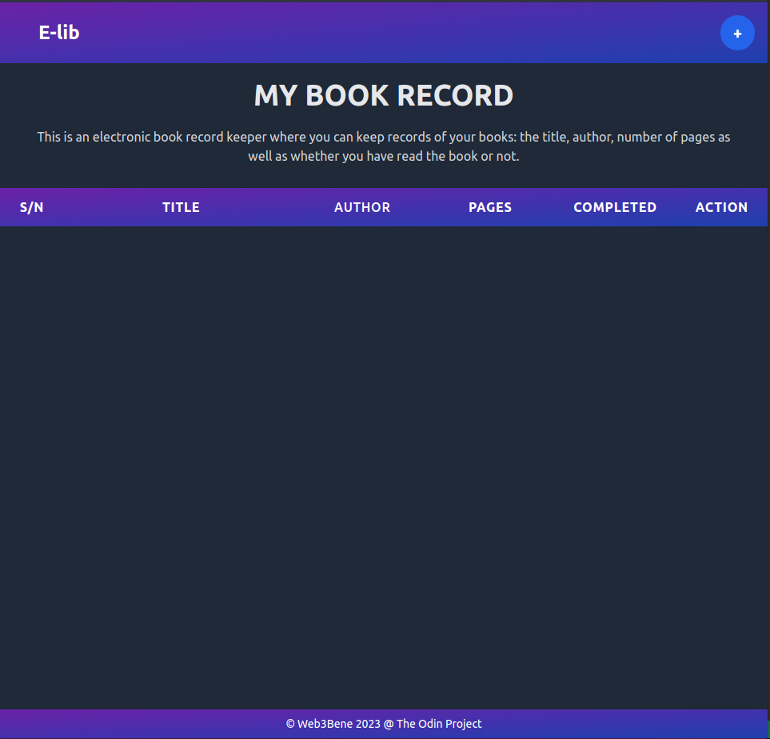
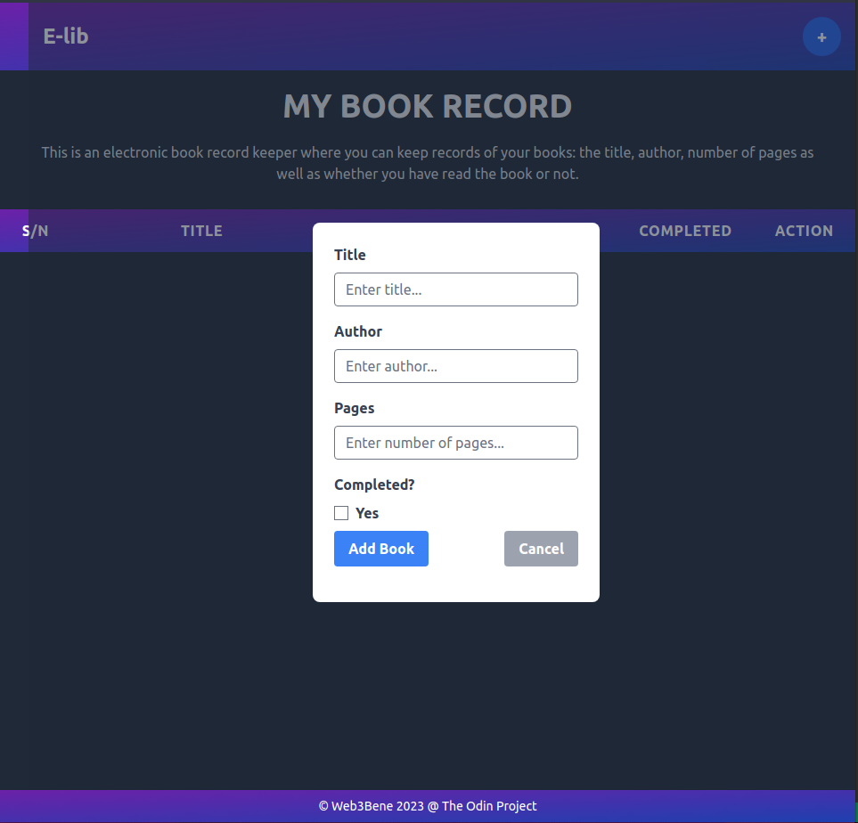
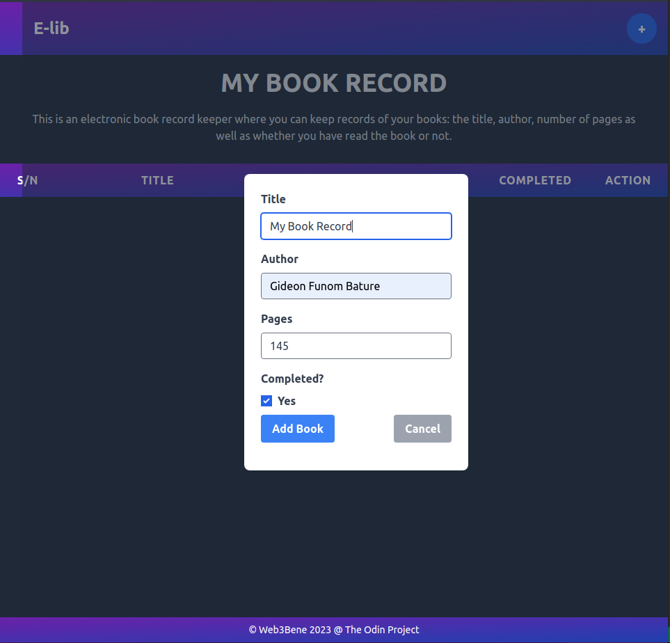
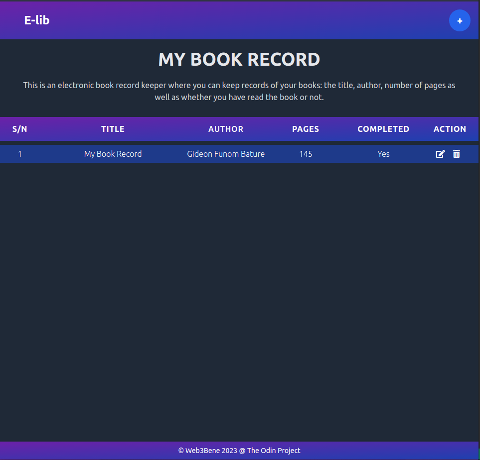
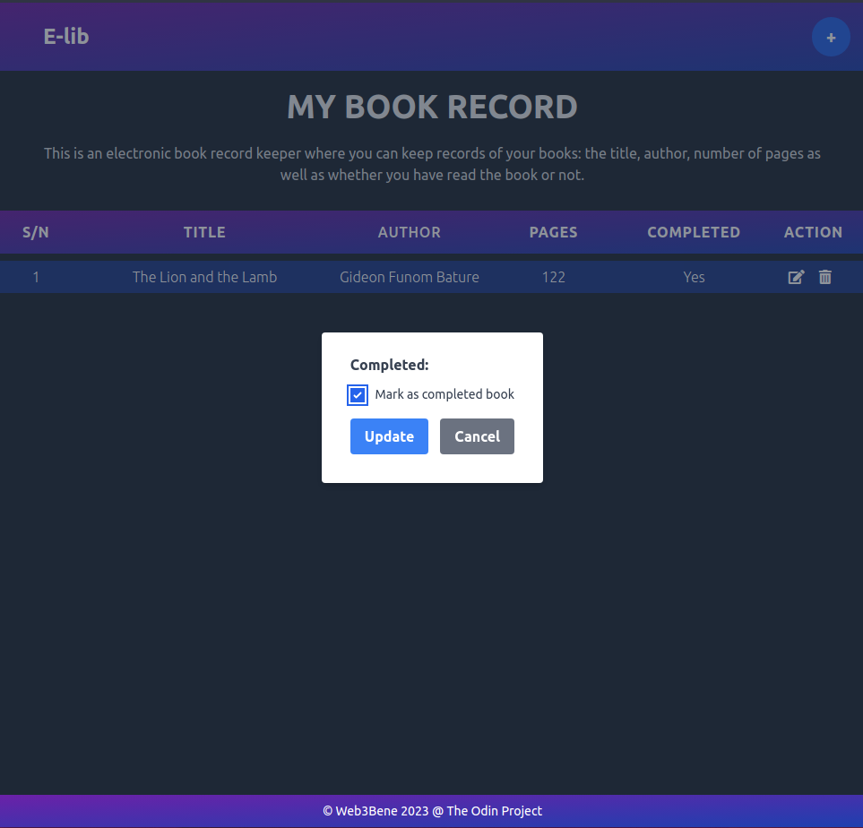

# E-Lib - A Book Library App

This is a JavaScript application for managing a book library. It allows users to add, edit and delete books from their library. It also help them to keep a track of whether they have completed reading the book or not.

## Features
- Add books to the library
- Edit existing books
- Delete books from the library
- View the list of books in the library

## Technologies Used

- HTML
- TailwindCSS
- JavaScript

## How to Use

1. Click on the "Add Book" button to add a new book to the library.
1. Fill out the form with the book's title, author, and number of pages. Indicate whether you have completed reading the book or not.
1. Click the "Add Book" button to add the book to your library.
1. The book will be added to the table of books in the library.
1. To edit a book, click the "Edit" button next to the book you want to edit. Update the fields in the form, and then click the "Update" button.
1. To delete a book, click the "Delete" button next to the book you want to delete.

## Preview

Here's a screenshot of what the app looks like:

[Click here](https://gideonbature.github.io/Project-Library/) for the full web App application.

- The main interface of the Application

- The entry point of the app

- Entered data as seen in the screenshot

- Stored Data after it was entered

- The Edit Interface for the Completed

## Setup

1. Clone the repository to your local machine.
1. Open the index.html file in your web browser.

## Features
- Navigation bar with buttons
- Toggle switch for light/dark mode

## Credits
This project was created by [Gideon Bature](https://github.com/GideonBature) as a part of [The Odin Project](https://www.theodinproject.com) web development curriculum. It was built using Tailwind CSS, a utility-first CSS framework.